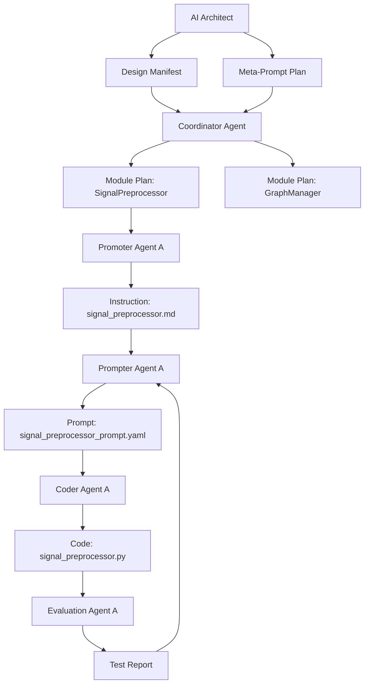

# 🧠 Quantum Virtual Mind (QVM) Project

*Developing a Cognitive Simulation System Using a Multi-Agent AI Coding Architecture*

## 🔷 Project Vision

The Quantum Virtual Mind (QVM) project is an AI-generated system that models cognitive state transitions using a quantum-inspired simulation engine. It is not built by hand — it is built by layers of intelligent agents writing code, generating prompts, and refining architecture recursively.

## 🧱 Multi-Agent Development Stack

| Layer | Role                        | Description                                         |
|-------|-----------------------------|-----------------------------------------------------|
| 0     | AI Architect                | Defines vision and meta-prompts                     |
| 1     | Coordinator Agent           | Breaks down project into components                 |
| 2     | Promoter Agents             | Write structured module instructions                |
| 3     | Prompter Agents             | Generate structured prompts                         |
| 4     | Coder Agents                | Generate code from prompts                          |
| 5     | Evaluation & Feedback Agents| Run tests, report issues, trigger refinement        |

## 🔄 Recursive Feedback Workflow



## 📁 Folder Structure

```
qvm_project/
├── architect/
│   ├── qvm_project_doc.md
│   └── design_manifest.yaml
├── coordinator/
│   └── module_plan.yaml
├── promoters/
│   └── instructions/
│       └── signal_preprocessor.md
├── prompters/
│   └── prompts/
│       └── signal_preprocessor_prompt.yaml
├── coders/
│   └── src/qvm/
│       └── signal_preprocessor.py
├── evaluators/
│   └── tests/
│       └── test_signal_preprocessor.py
├── shared_memory/
│   └── chroma_vector_store/
└── README.md
```

## 🔧 Toolchain

| Task                  | Tools Used             |
|-----------------------|------------------------|
| Prompting             | LangChain, LangGraph   |
| Code Generation       | GPT-4, OpenAI Codex    |
| Evaluation            | Phoenix, LangSmith     |
| Memory & Traceability | ChromaDB, FAISS        |

## 🚀 Why QVM Matters

This project showcases what happens when AI builds AI — at scale, recursively, and with precision. Every module here was constructed by a team of AI agents collaborating across layers, memory, and feedback loops.